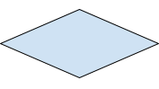

# Flowcharts

A flowchart is a way of visually representing an algorithm. The whole point of a flowchart is to represent the movement that goes through a program. It should be a step by step representation of a program. They are used in many differnet situations but are quite common to map out program design in Computer Science.

An example would be the following:

||
|:--:|
|[Source](https://www.twinkl.com.tw/teaching-wiki/flow-chart)|


In this example, you can see a real life example of a flowchart for making a cup of tea. You can see as a visual representation of the process for making it. There are shapes, connected by arrows, that represent different parts of the process. The shapes are shown as follows:

<table>
<tr>
<th>Shape </th>
<th>Name </th>
<th>Description</th>
<th>Python</th>
</tr>
<tr>
<td></td>
<td>Terminator</td>
<td>Starts and finishes the flowchart.<br>NOTE: This will only have a single arrow going to / from it</td>
<td> 

```python 
#nothing for this!
```
</td>
</tr>
<tr>
<td></td>
<td>Process</td>
<td>This represents some change in the internal state of the program. In Python it is normally a line of code that contains the = sign</td>
<td>

```python
x = 17
myObject = someMethod(vairable)
```
</td>
</tr>

<tr>
<td></td>
<td>Input Output</td>
<td>This represents some input or output in the program. It could be from the user or some other location like a file or database. </td>
<td>

```python
my_var = input()
data = open("some_file.txt", "r")
```
</td>
</tr>

||Decision|This represents a place where the code can branch. NOTE: A decision will always have more than one output arrow, normally marked with YES/NO or TRUE/FALSE|```if c < 10: # do stuff```<br> |


</table>