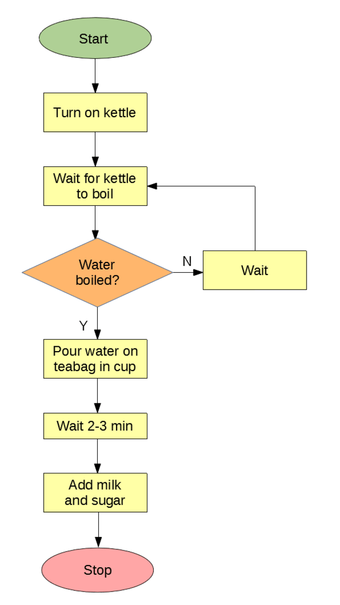
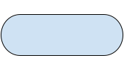
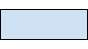
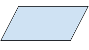
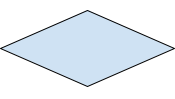
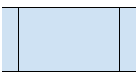
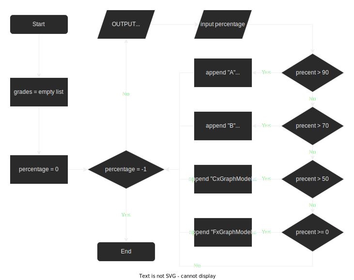

# Flowcharts

A flowchart is a way of visually representing an algorithm. The whole point of a flowchart is to represent the movement that goes through a program. It should be a step by step representation of a program. They are used in many differnet situations but are quite common to map out program design in Computer Science.

An example would be the following:

||
|:--:|
|[Source](https://www.twinkl.com.tw/teaching-wiki/flow-chart)|


In this example, you can see a real life example of a flowchart for making a cup of tea. You can see as a visual representation of the process for making it. There are shapes, connected by arrows, that represent different parts of the process. The shapes are shown as follows:

<table>
<tr>
<th>Shape </th>
<th>Name </th>
<th>Description</th>
<th>Python</th>
</tr>
<tr>
<td></td>
<td>Terminator</td>
<td>Starts and finishes the flowchart.<br>NOTE: This will only have a single arrow going to / from it</td>
<td> 

```python 
#nothing for this!
```
</td>
</tr>
<tr>
<td></td>
<td>Process</td>
<td>This represents some change in the internal state of the program. In Python it is normally a line of code that contains the = sign</td>
<td>

```python
x = 17
myObject = someMethod(vairable)
```
</td>
</tr>

<tr>
<td></td>
<td>Input Output</td>
<td>This represents some input or output in the program. It could be from the user or some other location like a file or database. </td>
<td>

```python
my_var = input()
data = open("some_file.txt", "r")
```
</td>
</tr>
<tr>
<td></td>
<td>Decision</td>
<td>This represents a place in your code where there are different options going forward, generally if/case statements or some kind of loop. </td>
<td>

```python
if x < 10:
    print('x is small')

while True:
    doSomeFunction()
```
</td>
</tr>
<tr>
<td></td>
<td>Subprocess</td>
<td>The represents a function call. So if you have a written a function and want to use it in your flowchart you can add that here.</td>
<td>

```python
x = [1,2,3,4]

my_function(x) # this is the subprocess


```
</td>
</tr>

</table>

---


## Converting an algorithm to a flowchart
So considering the shapes above, you should think about how you can covert between program code and flowcharts. Traditionally when making a flowchart you would design it before your write any code yourself, so lets try and do it that way.



This flowchart is designed to allow a user to input a series of grades. These will be converted to letter grades and changed into a list. The following Python code shows how this would be converted. There are comments linking the flowchart symbols to the code

```python
# Start is just the start of the program

# The two process boxes would look like this, almost the same
grades = []
percentage = 0

# The next decision box is a while loop. You can tell because the code loops round and an arrow comes back in.
# There are some other decisions in the loop, but you can tell that this is the loop descision because it is the first of last decision in the loop.
while percentage != -1:

    # Next we have an output, represented here by a print statement
    print("Enter a percentage, -1 to quit")

    # Note for the input, we don't have to change it to an integer in the flowchart
    percentage = int(input())

    # The following decisions are if statements. You can tell as the arrows don't loop back to them directly.
    # In this example, if and elif make the most sense, but you need to think about the correctness.

    if percentage > 90:
        grades.append('A')
    elif percentage > 70:
        grades.append('B')
    elif percentage > 50:
        grades.append('C')
    elif percentage > 70:
        grades.append('F')

```

