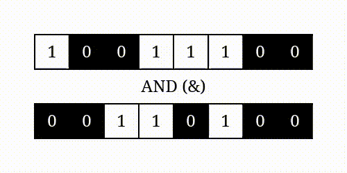

# Logic Gates

Logic gates are parts of a computer that make up the CPU. At the lowest level everything on a computer is in binary data. The calculations and data transformations that a computer carries out are all done through these logic gates.

You should first read and complete the exercises of [Khan academy's](https://www.khanacademy.org/computing/computers-and-internet/xcae6f4a7ff015e7d:computers/xcae6f4a7ff015e7d:logic-gates-and-circuits/a/logic-gates) excellent introduction to the idea of logic gates and logic circuits. This will introduce you to the __AND/OR/NOT__ logic gates. Leave the logic circuits for now, we will come back to those later. 

Once you are comfortable with __AND OR__ and __NOT__,  you need to also know the following gates: __NAND, NOR__ and __EOR/XOR__.

---

## NAND
A __NAND__ gate is actually a combination of two gates, __NOT__ and __AND__. This means that if you understand these two gates this should be pretty straightforward. 

These two diagrams represent the same thing. The one on the right is a __NAND__ gate, but this is identical to the two gates on the left. If we consider that, then you can come up with the truth table for the __NAND__ gate. Try and complete the table before you check the answer yourself.

|A|B|A __NAND__ B|
|---|---|:---:|
|0|0|_|
|0|1|_|
|1|0|_|
|1|1|_|

Solution

|A|B|A __NAND__ B|
|---|---|:---:|
|0|0|1|
|0|1|1|
|1|0|1|
|1|1|0|

---

## NOR

Similar to a __NAND__ gate is a __NOR__ gate. This is a combination of __NOT__ and __OR__.

Again for the truth table, try and take a guess as to what the output will be before you look at the answers.

|A|B|A __NOR__ B|
|---|---|:---:|
|0|0|_|
|0|1|_|
|1|0|_|
|1|1|_|

Solution

|A|B|A __NOR__ B|
|---|---|:---:|
|0|0|1|
|0|1|0|
|1|0|0|
|1|1|0|

---

## Exclusive OR

The last new logic gate is slightly different from the others. Exclusive or is known as __XOR__ or __EOR__. This is a logic gate that only gives true if exactly one of it's two inputs is true.

|A|B|A __XOR__ B|
|---|---|:---:|
|0|0|0|
|0|1|1|
|1|0|1|
|1|1|0|

With __NAND__ and __NOR__ the combination of logic gates to produce the output is pretty obvious. Can you work out what combination of logic gates your need to put together to produce an __XOR__ gate?

XOR

|A|B|A __OR__ B|A __NAND__ B|(A __OR__ B) __AND__ (A __NAND__ B)|
|---|---|:---:|:---:|:---:|
|0|0|0|1|0|
|0|1|1|1|1|
|1|0|1|1|1|
|1|1|1|0|0|

With all of these details put together you can start seeing how putting together different logic gates can lead to the creation of new logic gates.

### Activity

Go on to the [NandGame](https://nandgame.com/) and see how everything on a computer is actually made up from __NAND__ gates. The first level is a little different from the others as you are going even further down the rabbit hole to the level of transistors, which make up __NAND__ gates. That's as far as you can go! You should try and complete all the levels up to __XOR__ which should be easy given what you have seen above.

---
---

# Bitwise operators

Bitwise operator are special assignment operators that work on the bits of variables. Consider the two denary numbers 156 and 52. If we convert these numbers to binary you get the following values:

<table>
    <thead>
        <tr>
            <th>Decimal</th>
            <th>|</th>
            <th colspan="8">Binary</th>
        </tr>
    </thead>
    <tbody>
        <tr>
            <td>156</td>
            <td>|</td>
            <td>1</td>
            <td>0 </td>
            <td>0 </td>
            <td>1 </td>
            <td>1 </td>
            <td>1 </td>
            <td>0 </td>
            <td>0 </td>
        </tr><tr>
            <td> 52</td>
            <td>|</td>
            <td> 0</td>
            <td>0 </td>
            <td>1 </td>
            <td>1 </td>
            <td>0 </td>
            <td>1 </td>
            <td>0 </td>
            <td>0 </td>
        </tr>
        <tr>
            <td> AND</td>
            <td>|</td>
            <td> 0</td>
            <td>0 </td>
            <td>0 </td>
            <td>1 </td>
            <td>0 </td>
            <td>1 </td>
            <td>0 </td>
            <td>0 </td>
        </tr>
    </tbody>
</table>

||
|:--:|
|[Source](https://realpython.com/python-bitwise-operators/)|