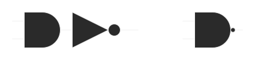
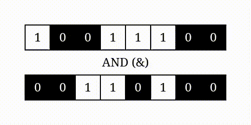
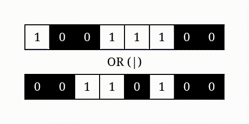
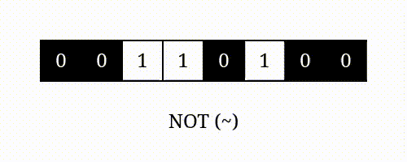

# Logic Gates

Logic gates are parts of a computer that make up the CPU. At the lowest level everything on a computer is in binary data. The calculations and data transformations that a computer carries out are all done through these logic gates.

You should first read and complete the exercises of [Khan academy's](https://www.khanacademy.org/computing/computers-and-internet/xcae6f4a7ff015e7d:computers/xcae6f4a7ff015e7d:logic-gates-and-circuits/a/logic-gates) excellent introduction to the idea of logic gates and logic circuits. This will introduce you to the __AND/OR/NOT__ logic gates. Leave the logic circuits for now, we will come back to those later. 

Once you are comfortable with __AND OR__ and __NOT__,  you need to also know the following gates: __NAND, NOR__ and __EOR/XOR__.

---

## NAND
A __NAND__ gate is actually a combination of two gates, __NOT__ and __AND__. This means that if you understand these two gates this should be pretty straightforward. 



These two diagrams represent the same thing. The one on the right is a __NAND__ gate, but this is identical to the two gates on the left. If we consider that, then you can come up with the truth table for the __NAND__ gate. Try and complete the table before you check the answer yourself.

|A|B|A __NAND__ B|
|---|---|:---:|
|0|0|_|
|0|1|_|
|1|0|_|
|1|1|_|


<details>
<summary>Solution</summary>

|A|B|A __NAND__ B|
|---|---|:---:|
|0|0|1|
|0|1|1|
|1|0|1|
|1|1|0|

</details>


---

## NOR

Similar to a __NAND__ gate is a __NOR__ gate. This is a combination of __NOT__ and __OR__.


Again for the truth table, try and take a guess as to what the output will be before you look at the answers.


|A|B|A __NOR__ B|
|---|---|:---:|
|0|0|_|
|0|1|_|
|1|0|_|
|1|1|_|


<details>
<summary>Solution</summary>

|A|B|A __NOR__ B|
|---|---|:---:|
|0|0|1|
|0|1|0|
|1|0|0|
|1|1|0|

</details>

---

## Exclusive OR

The last new logic gate is slightly different from the others. Exclusive or is known as __XOR__ or __EOR__. This is a logic gate that only gives true if exactly one of it's two inputs is true.

|A|B|A __XOR__ B|
|---|---|:---:|
|0|0|0|
|0|1|1|
|1|0|1|
|1|1|0|


With __NAND__ and __NOR__ the combination of logic gates to produce the output is pretty obvious. Can you work out what combination of logic gates your need to put together to produce an __XOR__ gate?

<details>
<summary>XOR</summary>

|A|B|A __OR__ B|A __NAND__ B|(A __OR__ B) __AND__ (A __NAND__ B)|
|---|---|:---:|:---:|:---:|
|0|0|0|1|0|
|0|1|1|1|1|
|1|0|1|1|1|
|1|1|1|0|0|

</details>

With all of these details put together you can start seeing how putting together different logic gates can lead to the creation of new logic gates.

### Activity

Go on to the [NandGame](https://nandgame.com/) and see how everything on a computer is actually made up from __NAND__ gates. The first level is a little different from the others as you are going even further down the rabbit hole to the level of transistors, which make up __NAND__ gates. That's as far as you can go! You should try and complete all the levels up to __XOR__ which should be easy given what you have seen above.

---
---

# Bitwise operators

Bitwise operator are special assignment operators that work on the bits of variables. Consider the two denary numbers 156 and 52. If we convert these numbers to binary you get the following values:


<table>
    <thead>
        <tr>
            <th>Decimal</th>
            <th>|</th>
            <th colspan="8">Binary</th>
        </tr>
    </thead>
    <tbody>
        <tr>
            <td>156</td>
            <td>|</td>
            <td>1</td>
            <td>0 </td>
            <td>0 </td>
            <td>1 </td>
            <td>1 </td>
            <td>1 </td>
            <td>0 </td>
            <td>0 </td>
        </tr><tr>
            <td> 52</td>
            <td>|</td>
            <td> 0</td>
            <td>0 </td>
            <td>1 </td>
            <td>1 </td>
            <td>0 </td>
            <td>1 </td>
            <td>0 </td>
            <td>0 </td>
        </tr>
        <tr>
            <td> AND</td>
            <td>|</td>
            <td> 0</td>
            <td>0 </td>
            <td>0 </td>
            <td>1 </td>
            <td>0 </td>
            <td>1 </td>
            <td>0 </td>
            <td>0 </td>
        </tr>
    </tbody>
</table>

Looking at the individual bits of these numbers we can then perform the and operation on them individually. So looking at the smallest bit we can see that this is 0 in 156, 0 in 52. From the logical operators about 0 __AND__ 0 results in 0. Moving through these, you can see that this continues. Looking at the values above  __AND__ below gives us an output. In this case it is 10100. We could then turn this back into a standard denary number, in this case 20.

These operations are all possible in Python too using special operators. 

```python
a = 156
b = 52
result = a & b
print(result) # 20
```

This gif shows you a good example of how this works.

||
|:--:|
|[Source](https://realpython.com/python-bitwise-operators/)|

## Bitwise OR

Bitwise OR works in a similar way. In this case you look through and OR each of the individual bits. 

||
|:--:|
|[Source](https://realpython.com/python-bitwise-operators/)|

In this example we have the same numbers but they will give a different result.


<table>
    <thead>
        <tr>
            <th>Decimal</th>
            <th>|</th>
            <th colspan="8">Binary</th>
        </tr>
    </thead>
    <tbody>
        <tr>
            <td>156</td>
            <td>|</td>
            <td>1</td>
            <td>0 </td>
            <td>0 </td>
            <td>1 </td>
            <td>1 </td>
            <td>1 </td>
            <td>0 </td>
            <td>0 </td>
        </tr><tr>
            <td> 52</td>
            <td>|</td>
            <td> 0</td>
            <td>0 </td>
            <td>1 </td>
            <td>1 </td>
            <td>0 </td>
            <td>1 </td>
            <td>0 </td>
            <td>0 </td>
        </tr>
        <tr>
            <td> OR</td>
            <td>|</td>
            <td>1</td>
            <td>0 </td>
            <td>1 </td>
            <td>1 </td>
            <td>1 </td>
            <td>1 </td>
            <td>0 </td>
            <td>0 </td>
        </tr>
    </tbody>
</table>

In this case 188. Python can also perform the  bitwise __OR__ with the following notation.

```python
a = 7
b = 10

result = a | b

print(result) # 15
```

## Bitwise __NOT__

By now you should be getting the hang of this. Here the operator is a unitary operator, it only works on one value. Bitwise __NOT__ flips the bits of a binary number.

||
|:--:|
|[Source](https://realpython.com/python-bitwise-operators/)|

Again we can do this in python with the ~ operator. However, you will notice that your results get a bit weird. This is due to how python saves negative numbers. See [this note](https://www.rit.edu/academicsuccesscenter/sites/rit.edu.academicsuccesscenter/files/documents/math-handouts/DM3_TwosComplement_BP_9_22_14.pdf) on Two's Complement to understand what is happening.

```Python
x = 15
print(~x) # -16
```

## Shifts

The last two operators we will look at are different from what we have seen so far. These involve manipulating the position of a bit. 

<table>
    <thead>
        <tr>
            <th></th>
            <th>|</th>
            <th colspan="8">Binary</th>
        </tr>
    </thead>
    <tbody>
        <tr>
            <td>Original</td>
            <td>|</td>
            <td>0</td>
            <td>0 </td>
            <td>0 </td>
            <td>1 </td>
            <td>1 </td>
            <td>1 </td>
            <td>0 </td>
            <td>0 </td>
        </tr><tr>
            <td>Shift left 1</td>
            <td>|</td>
            <td> 0</td>
            <td>0 </td>
            <td>1 </td>
            <td>1 </td>
            <td>1 </td>
            <td>0 </td>
            <td>0 </td>
            <td><strong><em>0</em></strong> </td>
        </tr>
        <tr>
            <td>Shift left 2</td>
            <td>|</td>
            <td>0 </td>
            <td>1 </td>
            <td>1 </td>
            <td>1 </td>
            <td>0 </td>
            <td>0 </td>
            <td><strong><em>0</em></strong> </td>
            <td><strong><em>0</em></strong> </td>
        </tr>
    </tbody>
</table>

You can see here as the bits in your original number get moved to the left and new positions are filled with 0's to fill the new spaces.

Shift right does the opposite.

<table>
    <thead>
        <tr>
            <th></th>
            <th>|</th>
            <th colspan="8">Binary</th>
        </tr>
    </thead>
    <tbody>
        <tr>
            <td>Original</td>
            <td>|</td>
            <td>0</td>
            <td>0 </td>
            <td>0 </td>
            <td>1 </td>
            <td>1 </td>
            <td>1 </td>
            <td>0 </td>
            <td>0 </td>
        </tr><tr>
            <td>Shift right 1</td>
            <td>|</td>
            <td><strong><em>0</em></strong> </td>
            <td> 0</td>
            <td> 0</td>
            <td>0 </td>
            <td>1 </td>
            <td>1 </td>
            <td>1 </td>
            <td>0 </td>
        </tr>
        <tr>
            <td>Shift right 2</td>
            <td>|</td>
            <td><strong><em>0</em></strong> </td>
            <td><strong><em>0</em></strong> </td>
            <td>0 </td>
            <td>0 </td>
            <td>0 </td>
            <td>1 </td>
            <td>1 </td>
            <td>1 </td>
        </tr>
    </tbody>
</table>

Again python has operators that allow you to do this quickly and easily.
```python
x = 12
print(bin(x))       #0b1100

result = x << 2
print(bin(result))  #0b1100

y = 7
print(bin(y))       #0b111

result = 7 >> 1
print(bin(result))  #0b11
```

Note, because Python dynamically allocates memory for integers, left shifting an integer will never turn it negative. For languages like Java or C that have a fixed amount of memory for numbers, things can get pretty weird.

# Practice


### Math questions
Calculate the following problems by hand, then after you have worked them all out, check your answers in Python.
1. 3 & 7
2. ~22
3. 25 | 26
4. 127 ^ 1
5. (12 & 14) | (32 ^ 52)

### General problems
6. Consider the two equations:

    > _x = a & b_
    >
    > _y = a | b_

    What is the realtionship between _x_ and _y_? When are they the same, larger and smaller?

6. What is the relation ship between a number and its value when bit shifted left / right. Do some experimentation and see what happens to the decimal number of a value that is shifted left or right.

        EX:
         1101 and 11010
         111 and 11

6. In a programming language of your choice, write code to change a number from denary to binary. You cannot use the modulus or division, only bitwise operators.

6. Write a program to detect if a number is a power of 2. You can use loops, statements and bitwise operators.